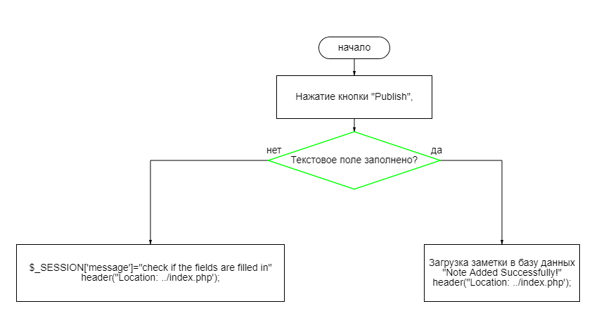
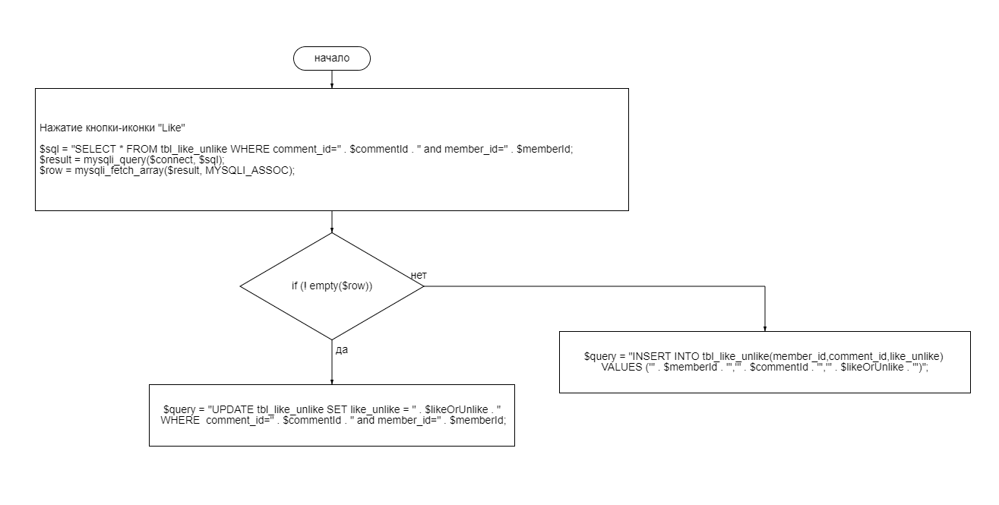
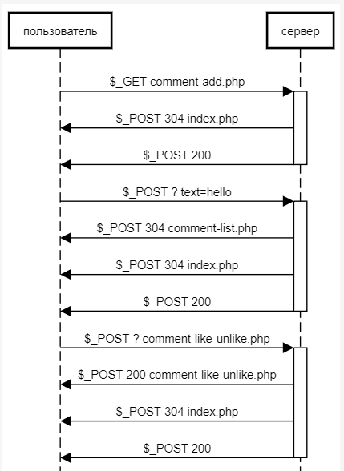

# ОТЧЁТ О ЛАБОРАТОРНОЙ РАБОТЕ №2
#### *По курсу "Основы Программирования"*

## Цель работы:
Разработать и реализовать клиент-серверную информационную систему, реализующую механизм CRUD
## Выполненные требования
* Возможность добавления постов в общую ленту
* Реагирования на посты (лайки и дизлайки)
* Добавление комментариев к чужим заметкам
## Ход работы
### Пользовательский интерфейс

   


### Пользовательский сценарий
1. Пользователь попадает на страницу index.php и вводит в текстовом поле сообщение, которое хочет оставить. После этого жмет на кнопку "Publish" и его сообщение выводится внизу под формой отправки заметки.  
2. Пользователь может ставить или убирать лайки, комментировать чужие заметки.

### API сервера

В основе приложения использована клиент-серверная архитектура. Обмен данными между клиентом и сервером осуществляется с помощью HTTP POST запросов. В теле POST запроса отправки поста используется поле  'comment_id', 'comment', 'name'. Для увеличения счётчика лайков используется форма с POST запросом. В теле POST запроса реакции используются 'like_unlike'.

### Хореография
1. *Отправка сообщения*. Принимается введенное сообщение. Отправляется запрос на добавление сообщения в базу данных, так же туда добавляется дата и  время написания сообщения. Затем происходит перенаправление на страницу index.php. Из базы данных выводится данное сообщение с датой и временем его написания. За этим постом закрепляется индивидуальный 'id'.
2. *Просмотр и оценка сообщений*. Кнопка-иконка в виде пальца вверх вызывает отправление запроса в базу данных на изменение количества лайков в посте с привязанным 'id'.

## Описание структуры базы данных
Браузерное приложение phpMyAdminДля используется для просмотра содержимого базы данных. 2 таблицы:
Первая таблица tbl_comment:


1. "comment_id" типа int с автоинкрементом для выдачи уникальных id всем сообщениям
2. "parent_comment_id" типа int для хранения старшего комментария
3. "comment" типа varchar для хранения сообщения заметки
4. "comment_sender_name" типа varchar для хранения имени отправителя
5. "date" типа datetime для хранения даты отправки заметки


Вторая таблица tbl_like_unlike:
1. "id" типа int с автоинкрементом для выдачи уникальных id всем лайкам
2. "member_id" типа int для хранения уникального id пользователя
3. "comment_id" типа int для хранения уникального id комментария
4. "like_unlike" типа int для хранения счетчика лайков
5. "	date" типа datetime для хранения даты отправки заметки


## Описание алгоритмов
1. Алгоритм отправки сообщения                        
                                         
2. Алгоритм лайка                                                   
                 


## Примеры HTTP запросов/ответов



## Значимые фрагменты кода
1. Функция отправки заметки в базу данных
```
<?php
require_once ("db.php");
$commentId = isset($_POST['comment_id']) ? $_POST['comment_id'] : "";
$comment = isset($_POST['comment']) ? $_POST['comment'] : "";
$commentSenderName = isset($_POST['name']) ? $_POST['name'] : "";
$date = date('Y-m-d H:i:s');

$sql = "INSERT INTO tbl_comment(parent_comment_id, comment, comment_sender_name, date) VALUES (0,'" . $comment . "','" . $commentSenderName . "','" . $date . "')";

$result = mysqli_query($connect, $sql);

if (! $result) {
    $result = mysqli_error($connect);
}
echo $result;
?>

```
2. Функция для вывода заметок
```
<?php
require_once ("db.php");
$memberId = 1;
$sql = "SELECT tbl_comment.*,tbl_like_unlike.like_unlike FROM tbl_comment LEFT JOIN tbl_like_unlike ON tbl_comment.comment_id = tbl_like_unlike.comment_id AND member_id = " . $memberId . " ORDER BY parent_comment_id DESC, comment_id DESC";

$result = mysqli_query($connect, $sql);
$record_set = array();
while ($row = mysqli_fetch_assoc($result)) {
    array_push($record_set, $row);
}
mysqli_free_result($result);

mysqli_close($connect);
echo json_encode($record_set);
?>
```
3. Функция лайков
```
<?php
require_once ("db.php");

$memberId = 1;
$commentId = $_POST['comment_id'];
$likeOrUnlike = 0;
if($_POST['like_unlike'] == 1)
{
$likeOrUnlike = $_POST['like_unlike'];
}

$sql = "SELECT * FROM tbl_like_unlike WHERE comment_id=" . $commentId . " and member_id=" . $memberId;
$result = mysqli_query($connect, $sql);
$row = mysqli_fetch_array($result, MYSQLI_ASSOC);

if (! empty($row)) 
{
    $query = "UPDATE tbl_like_unlike SET like_unlike = " . $likeOrUnlike . " WHERE  comment_id=" . $commentId . " and member_id=" . $memberId;
} else
{
    $query = "INSERT INTO tbl_like_unlike(member_id,comment_id,like_unlike) VALUES ('" . $memberId . "','" . $commentId . "','" . $likeOrUnlike . "')";
}
mysqli_query($connect, $query);

$totalLikes = "No ";
$likeQuery = "SELECT sum(like_unlike) AS likesCount FROM tbl_like_unlike WHERE comment_id=".$commentId;
$resultLikeQuery = mysqli_query($connect,$likeQuery);
$fetchLikes = mysqli_fetch_array($resultLikeQuery,MYSQLI_ASSOC);
if(isset($fetchLikes['likesCount'])) {
    $totalLikes = $fetchLikes['likesCount'];
}

echo $totalLikes;
?>
```

